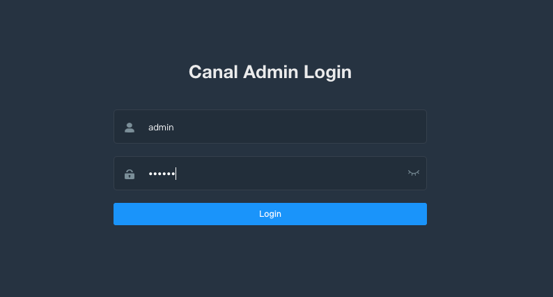

# Canal同步mysql数据到es

## 环境信息

docker

mysql 8.0.25

canal 1.1.5

canal-admin 1.1.5

canal-adapter 1.1.5

elasticsearch 7.3.0

## 环境搭建

### mysql

修改my.ini，开启binlog

```yaml
[mysqld]
log-bin=mysql-bin
binlog-format=ROW
server-id=1
```

使用docker-compose启动mysql

```yaml
version: '3'

services:
  db:
    container_name: mysql8
    image: mysql:8.0.25
    command: mysqld --default-authentication-plugin=mysql_native_password --character-set-server=utf8mb4 --collation-server=utf8mb4_unicode_ci
    environment:
      MYSQL_ROOT_PASSWORD: root
      MYSQL_DATABASE: user
      MYSQL_ALLOW_EMPTY_PASSWORD: "yes"
    ports:
      - '3306:3306'
    volumes:
      - './data:/var/lib/mysql'
      - '.my.cnf:/etc/mysql/conf.d/my.cnf'
```

### elasticsearch

使用docker-compose搭建一个单机版的es，并且启动kibana控制台方便一会操作

```yaml
version: '3'
services:
  node01:
    image: docker.elastic.co/elasticsearch/elasticsearch:7.3.0
    container_name: node01
    environment:
      - node.name=node01
      - cluster.name=es-cluster-7
      - discovery.type=single-node
      - "ES_JAVA_OPTS=-Xms1024m -Xmx1024m"
    ulimits:
      memlock:
        soft: -1
        hard: -1
    volumes:
      - es-data01:/usr/share/elasticsearch/data
    ports:
      - 9200:9200
    networks:
      - es-network

  kibana:
    image: docker.elastic.co/kibana/kibana:7.3.0
    environment:
      ELASTICSEARCH_HOSTS: http://node01:9200
    ports:
      - 5601:5601
    networks:
      - es-network
    depends_on:
      - node01

volumes:
  es-data01:
    driver: local

networks:
  es-network:
    driver: bridge
```

kibana.yml

```
elasticsearch.url: "http://es:9200"
server.host: "0.0.0.0"
```

### canal-admin

下载canal-admin的运行脚本

```bash
wget https://raw.githubusercontent.com/alibaba/canal/master/docker/run_admin.sh
```

执行canal_manager.sql初始化canal-admin的数据表

启动canal-admin

```bash
sh run_admin.sh -e server.port=8089 \
        -e canal.adminUser=admin \
        -e canal.adminPasswd=123456 \
        -e spring.datasource.address=docker.for.mac.host.internal:3306 \
        -e spring.datasource.database=canal_manager \
        -e spring.datasource.username=root \
        -e spring.datasource.password=root
```

访问`http://localhost:8089/` 密码是admin/123456



### canal

创建一个专用的canal账号

```sql
CREATE USER canal IDENTIFIED BY 'canal';  
GRANT SELECT, REPLICATION SLAVE, REPLICATION CLIENT ON *.* TO 'canal'@'%';
FLUSH PRIVILEGES;
```

下载canal启动脚本

```bash
wget https://raw.githubusercontent.com/alibaba/canal/master/docker/run.sh
```

运行canal

```
sh run.sh -e canal.admin.manager=docker.for.mac.host.internal:8089 \
         -e canal.admin.port=11110 \
         -e canal.port=11121 \
         -e canal.metrics.pull.port=11122 \
         -e canal.admin.user=admin \
         -e canal.admin.passwd=6BB4837EB74329105EE4568DDA7DC67ED2CA2AD9
```

### canal-adapter

canal-adapter官方没有提供镜像，这里我们自己做一个。

Dockerfile

```dockerfile
FROM openjdk:8-jre-alpine
RUN echo "Asia/Shanghai" > /etc/timezone
ADD https://github.com/alibaba/canal/releases/download/canal-1.1.5/canal.adapter-1.1.5.tar.gz /opt/canal/adapter/
WORKDIR /opt/canal/adapter
COPY conf /opt/canal/adapter/conf/
ENTRYPOINT ["sh", "-c", "sh /opt/canal/adapter/bin/startup.sh && tail -F logs/adapter/adapter.log"]
```


当然也可以直接用我做好的

## 数据同步


## 完整代码

https://github.com/lmikoto/mysql-to-es-demo


