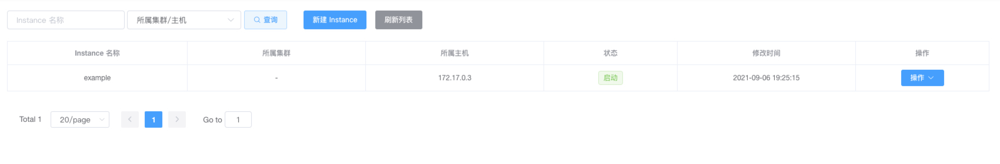
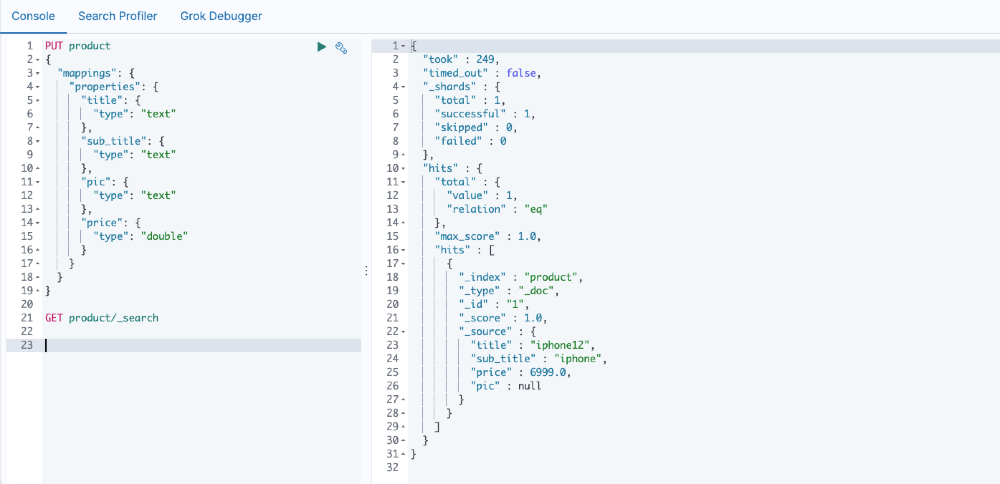

# Canal同步mysql数据到es

## 环境信息

docker

mysql 8.0.25

canal 1.1.5

canal-admin 1.1.5

canal-adapter 1.1.5

elasticsearch 7.3.0

## 环境搭建

### mysql

修改my.ini，开启binlog

```yaml
[mysqld]
log-bin=mysql-bin
binlog-format=ROW
server-id=1
```

使用docker-compose启动mysql

```yaml
version: '3'

services:
  db:
    container_name: mysql8
    image: mysql:8.0.25
    command: mysqld --default-authentication-plugin=mysql_native_password --character-set-server=utf8mb4 --collation-server=utf8mb4_unicode_ci
    environment:
      MYSQL_ROOT_PASSWORD: root
      MYSQL_DATABASE: user
      MYSQL_ALLOW_EMPTY_PASSWORD: "yes"
    ports:
      - '3306:3306'
    volumes:
      - './data:/var/lib/mysql'
      - '.my.cnf:/etc/mysql/conf.d/my.cnf'
```

### elasticsearch

使用docker-compose搭建一个单机版的es，并且启动kibana控制台方便一会操作

```yaml
version: '3'
services:
  node01:
    image: docker.elastic.co/elasticsearch/elasticsearch:7.3.0
    container_name: node01
    environment:
      - node.name=node01
      - cluster.name=es-cluster-7
      - discovery.type=single-node
      - "ES_JAVA_OPTS=-Xms1024m -Xmx1024m"
    ulimits:
      memlock:
        soft: -1
        hard: -1
    volumes:
      - es-data01:/usr/share/elasticsearch/data
    ports:
      - 9200:9200
    networks:
      - es-network

  kibana:
    image: docker.elastic.co/kibana/kibana:7.3.0
    environment:
      ELASTICSEARCH_HOSTS: http://node01:9200
    ports:
      - 5601:5601
    networks:
      - es-network
    depends_on:
      - node01

volumes:
  es-data01:
    driver: local

networks:
  es-network:
    driver: bridge
```

kibana.yml

```
elasticsearch.url: "http://es:9200"
server.host: "0.0.0.0"
```

### canal-admin

下载canal-admin的运行脚本

```bash
wget https://raw.githubusercontent.com/alibaba/canal/master/docker/run_admin.sh
```

执行canal_manager.sql初始化canal-admin的数据表

启动canal-admin

```bash
sh run_admin.sh -e server.port=8089 \
        -e canal.adminUser=admin \
        -e canal.adminPasswd=123456 \
        -e spring.datasource.address=docker.for.mac.host.internal:3306 \
        -e spring.datasource.database=canal_manager \
        -e spring.datasource.username=root \
        -e spring.datasource.password=root
```

访问`http://localhost:8089/` 密码是admin/123456


### canal

创建一个专用的canal账号

```sql
CREATE USER canal IDENTIFIED BY 'canal';  
GRANT SELECT, REPLICATION SLAVE, REPLICATION CLIENT ON *.* TO 'canal'@'%';
FLUSH PRIVILEGES;
```

下载canal启动脚本

```bash
wget https://raw.githubusercontent.com/alibaba/canal/master/docker/run.sh
```

运行canal

```
sh run.sh -e canal.admin.manager=docker.for.mac.host.internal:8089 \
         -e canal.admin.port=11110 \
         -e canal.port=11111 \
         -e canal.metrics.pull.port=11122 \
         -e canal.admin.user=admin \
         -e canal.admin.passwd=6BB4837EB74329105EE4568DDA7DC67ED2CA2AD9
```


canal启动成功之后登陆canal-admin创建一个example的instance一会会用到

一个instance对应一个mysql实例



### canal-adapter

canal-adapter官方没有提供镜像，这里我们自己做一个。

Dockerfile

```dockerfile
FROM openjdk:8-jre-alpine
RUN echo "Asia/Shanghai" > /etc/timezone
ADD canal.adapter-1.1.5.tar.gz /opt/canal/adapter/

WORKDIR /opt/canal/adapter

ENTRYPOINT ["sh", "-c", "sh bin/startup.sh && tail -F logs/adapter/adapter.log"]
```

这里不从官方直接下载1.1.5的包。而是自己打一个，因为官方的1.1.5的包有问题，直到写这篇文章的时候还没解决。如果你正在参考这边文章，可以使用我打好的。或者参照https://github.com/alibaba/canal/issues/3144自己打一个

docker-compose.yml

```
version: '3'
services:
  adapter:
    build: .
    volumes:
      - "./conf:/opt/canal/adapter/conf"
```

修改配置文件

```
server:
  port: 8081
spring:
  jackson:
    date-format: yyyy-MM-dd HH:mm:ss
    time-zone: GMT+8
    default-property-inclusion: non_null

canal.conf:
  mode: tcp #tcp kafka rocketMQ rabbitMQ
  flatMessage: true
  zookeeperHosts:
  syncBatchSize: 1000
  retries: 0
  timeout:
  accessKey:
  secretKey:
  consumerProperties:
    # canal tcp consumer
    canal.tcp.server.host: docker.for.mac.host.internal:11111
    canal.tcp.zookeeper.hosts:
    canal.tcp.batch.size: 500
    canal.tcp.username:
    canal.tcp.password:

  srcDataSources:
    defaultDS:
      url: jdbc:mysql://docker.for.mac.host.internal:3306/test?useUnicode=true
      username: canal
      password: canal
  canalAdapters:
  - instance: example # canal instance Name or mq topic name
    groups:
    - groupId: g1
      outerAdapters:
        - name: logger
        - name: es7
          hosts: docker.for.mac.host.internal:9200 # 127.0.0.1:9200 for rest mode
          properties:
            mode: rest
            cluster.name: elasticsearch
```


启动canal-adapter

```bash
docker-compose up -d
```


## 数据同步

创建需要同步的表

```sql
CREATE TABLE `product` (
  `id` bigint NOT NULL AUTO_INCREMENT,
  `title` varchar(255) CHARACTER SET utf8 COLLATE utf8_general_ci DEFAULT NULL,
  `sub_title` varchar(255) CHARACTER SET utf8 COLLATE utf8_general_ci DEFAULT NULL,
  `price` decimal(10,2) DEFAULT NULL,
  `pic` varchar(255) CHARACTER SET utf8 COLLATE utf8_general_ci DEFAULT NULL,
  PRIMARY KEY (`id`) USING BTREE
) ENGINE=InnoDB;
```

使用kibana创建索引

```
PUT product
{
  "mappings": {
    "properties": {
      "title": {
        "type": "text"
      },
      "sub_title": {
        "type": "text"
      },
      "pic": {
        "type": "text"
      },
      "price": {
        "type": "double"
      }
    }
  }
}
```

修改`es7/product.yml`

```
dataSourceKey: defaultDS
destination: example
groupId: g1
esMapping:
  _index: product
  _id: _id 
  sql: "SELECT
         p.id AS _id,
         p.title,
         p.sub_title,
         p.price,
         p.pic
        FROM
         product p"
  etlCondition: "1=1"
  commitBatch: 3000
```

重启canal-adapter


使用mysql插入一条数据

```
INSERT INTO product ( id, title, sub_title, price, pic ) VALUES ( 1, 'iphone12', 'iphone', 6999.00, NULL );
```

查询es

```
GET product/_search
```

查询结果，可以看到已经同步成功了




## 完整代码

https://github.com/lmikoto/mysql-to-es-demo


